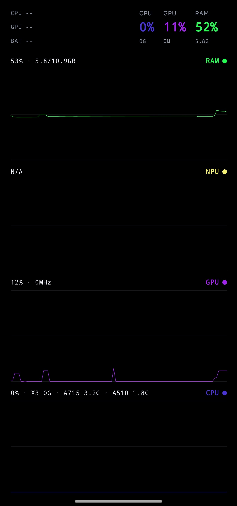
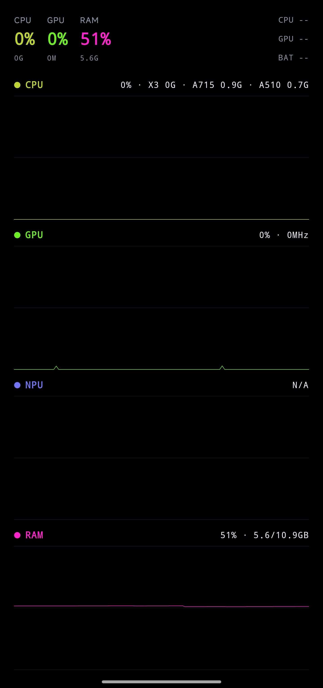

<p align="center">
  
</p>

# HardwareMonitor

一款跑在 Android 上的**实时硬件监控**小工具：开机常亮放在桌上当"性能小看板"，随时瞄一眼 CPU / GPU / NPU / RAM 占用、频率和温度。

## 特点

- **免 root**，直接读 Linux `sysfs` 节点，支持大多数高通机型（本项目在小米 13 Pro 上开发调优）
- 500ms 轮询，实时折线图（约 60 秒历史），四大项 + 温度一目了然
- **24h 常亮防烧屏**：深色/纯黑背景，周期性轮换 4 种布局 × 4 档配色（左右/上下对换等），10 分钟一个完整周期，避免 OLED 留下残影

## 截图

镜像布局轮换效果（文字在左 / 文字在右）：

| 布局变体 1 | 布局变体 2 |
|:---:|:---:|
|  |  |

## 技术栈

Kotlin · Jetpack Compose（Material 3）· 协程 + StateFlow

## 构建 / 安装

```bash
./gradlew :app:assembleDebug
adb install -r app/build/outputs/apk/debug/app-debug.apk
```
